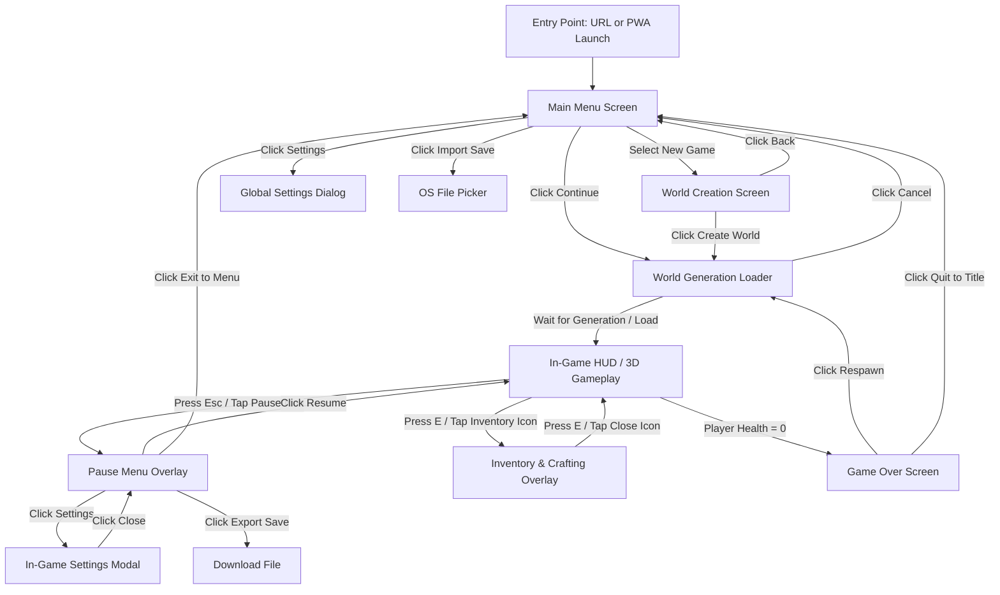

# BlockCraft User Flows Specification

Version: 1.0  
Status: Initial Release  
Author: Antigravity (Senior Product Designer)  
Date: 2026-07-11  

---

## 1. Overview

BlockCraft is a client-side procedural voxel sandbox game. The user experience is designed to be friendly, instant, and highly visual, appealing to children, families, and casual players. To support this, the interface uses a bright, playful aesthetic with clean layouts, soft colors, and immediate feedback.

### 1.1. Product Goals
* **Zero-Friction Fun:** Load and play in under 5 seconds. No account walls, no signup fields.
* **Child-Friendly Simplicity:** Clear icons, clean fonts, and visual indicators (like hearts and food icons) that make the gameplay status obvious.
* **Secure Privacy:** Inform the player clearly that all progress is saved on their own device.

### 1.2. Primary User Types
1. **Persona A: Leo (8, Student / Child):** Needs instant loading on low-end school devices, self-evident visual controls, and a safe, ad-free environment.
2. **Persona B: Sarah (28, Casual Gamer / Commuter):** Plays on an iPad/tablet. Needs highly responsive virtual joystick layouts, offline PWA access, and simple export/import backup tools to sync save files between device browsers.

### 1.3. User Entry Points
* **Direct Web URL:** Navigating directly to `https://blockcraft.game` (or hosted endpoint) on any desktop or mobile browser.
* **PWA Home Screen Icon:** Tapping the installed Progressive Web App icon on a mobile device or desktop desktop, launching the game in full-screen standalone mode without browser chrome.

---

## 2. Navigation Structure

---

## 3. Major User Journeys

### 3.1. Creating a New Game
* **Objective:** Configure a new procedural world and start playing.
* **Starting Point:** Main Menu Screen.
* **Trigger:** Click the "New Game" button.
* **Navigation Sequence:**
  1. The user clicks **New Game** on the Main Menu.
  2. The **World Creation Screen** renders.
  3. The user inputs a world name (defaults to "My World") or leaves it as default.
  4. The user selects a **World Size** option via rounded button selectors: **Small (256x256)**, **Medium (512x512)**, or **Large (1024x1024)**.
  5. The user selects a **Difficulty** option: **Easy** (fewer monsters, lower damage), **Medium** (balanced), or **Hard** (scarcer resources, aggressive threats).
  6. (Optional) The user enters a custom numeric **Seed** (or leaves it blank for a random seed).
  7. The user clicks **Create World**.
  8. The **World Generation Loader** overlay appears, showing a friendly progress bar and status text (e.g., "Digging Dirt...", "Planting Trees...", "Populating Animals...").
  9. Upon completion, the screen fades to reveal the 3D game world with the player active and the HUD visible.
* **Branching & Decision Points:**
  * If the user realizes they clicked "New Game" by mistake, they can click **Back** on the World Creation Screen to return to the Main Menu.
  * If the generation takes longer than expected, the user can click **Cancel** to abort the generation, safely clean up memory, and return to the Main Menu.
* **Success Outcome:** The player spawns in the world at coordinates `(0, y, 0)` with starting items in their hotbar.
* **Error Handling / Warning Modal Trigger:** 
  * If the user selects the **Large (1024x1024)** world size, the game runs a client-side device performance check.
  * If the device is classified as **Tier 1 (Low-End / Mobile)** (determined by mobile User-Agent, WebGL properties indicating a mobile GPU, or `navigator.deviceMemory < 4GB`), the game intercepts the flow after clicking **Create World**.
  * Instead of initiating generation immediately, it displays a soft warning modal: *"This device has limited memory. We recommend a Small or Medium world for the best performance. A Large world might cause the browser tab to restart."*
  * The user is presented with two choices:
    * **Create Anyway:** Proceeds to World Generation Loader.
    * **Go Back:** Returns the user to the World Creation Screen to adjust the size preset.

---

### 3.2. Resuming an Existing Game
* **Objective:** Re-enter a previously played world and restore progress.
* **Starting Point:** Main Menu Screen.
* **Trigger:** Click the "Continue" button.
* **Navigation Sequence:**
  1. The user returns to the game URL.
  2. The **Continue** button is active (automatically checked against `blockcraft_last_played` in LocalStorage and verifying existence in IndexedDB).
  3. The user clicks **Continue**.
  4. The **World Generation Loader** appears and displays: *"Loading Your World..."* while retrieving block chunks and player metadata from IndexedDB.
  5. Once loaded, the game restores player position, health, hunger, inventory, and environment time.
  6. The loader fades out, and the player resumes playing.
* **Success Outcome:** The player resumes gameplay at the exact coordinates and inventory state they were in when they last exited.
* **Recovery Flow:**
  * If the last played world metadata is missing or corrupted, the **Continue** button is grayed out, and a tooltip or subtext informs the player: *"No saved worlds found. Start a New Game!"*
  * If IndexedDB data was evicted by Safari's 7-day rule, a friendly warning pops up on the Main Menu: *"Browser storage was cleared. If you have a backup file (.blockcraft), click 'Import Save' to restore your world!"*

---

### 3.3. Exporting & Importing Saves
* **Objective:** Backup save progress or transfer worlds between different device browsers.
* **Starting Point:**
  * **Export:** In-Game Pause Menu.
  * **Import:** Main Menu Screen.
* **Export Trigger:** Click the "Backup World" button.
* **Import Trigger:** Click the "Import Save" button.

#### Export Sequence:
1. During active play, the user presses `Escape` or taps the **Pause** icon on mobile.
2. The **Pause Menu** overlay appears.
3. The user clicks **Backup World**.
4. The Save Manager compiles the active world seed, chunk deltas, and inventories from IndexedDB into a compressed JSON structure.
5. The browser automatically downloads a file named `${world_name}.blockcraft` to the player's downloads folder.
6. A gentle notification banner toasts at the top: *"Backup saved! Save this file to keep your progress safe."*
7. The Pause Menu remains open so the player can click **Resume Game**.

#### Import Sequence:
1. The user visits the game on a new browser/device.
2. The user clicks **Import Save** on the Main Menu.
3. The native OS **File Picker** opens.
4. The user selects a valid `.blockcraft` file.
5. The game validates the file format, extracts the world state, and writes it directly to the local IndexedDB.
6. The Main Menu refreshes, setting this world as the active saved game and enabling the **Continue** button.
7. A success dialog displays: *"World '${world_name}' imported successfully!"* with a bright button: **Play Now!**
8. Clicking **Play Now!** immediately loads the imported world.

* **Cancellation Path:** If the file selection is cancelled, the file picker closes and the Main Menu remains in its original state.
* **Error Handling:** If the user uploads an invalid file, a playful error modal appears: *"Oops! That file doesn't look like a valid BlockCraft save. Make sure the file ends with .blockcraft"* with a button to **Try Again**.

---

### 3.4. Gameplay Loop HUD & Pause Interactions
* **Objective:** Cycle between play, inventory management, crafting, and pausing.
* **Starting Point:** Active 3D gameplay.
* **Trigger:** Keyboard keypresses or on-screen mobile HUD buttons.

#### Inventory & Crafting Flow:
1. Player clicks the backpack icon on HUD or presses key `E`.
2. The 3D camera locks movement and a bright, friendly grid overlay opens.
3. The screen is divided into two sections:
   * **Inventory Grid:** Drag and drop items between the 27 storage slots and the 9 hotbar slots.
   * **Crafting Panel:** Displays a clear scrollable list of recipes. Selecting an item highlights the required materials with clean checkmarks or visual counts (e.g., "Wood: 2/3" in red, "Sticks: 4/2" in green).
4. Player taps a recipe and clicks the **Craft** button.
5. The crafted item enters the inventory, playing a soft pop sound effect.
6. The user clicks the close cross icon or presses `E` or `Escape` to return to active play.

#### Pause & Settings Adjustment Flow:
1. Player taps the gear/pause icon or presses `Escape`.
2. Gameplay physics and time-of-day freeze.
3. The **Pause Menu** overlay dims the screen with a clean light-translucent blur.
4. Player clicks **Settings**.
5. The **Settings Modal** displays:
   * Sound volume slider (0-100%).
   * Render distance selector (8, 10, or 12 chunks).
   * Graphics quality selector (Low, Medium, High).
   * **Control Layout Toggle:** Left-Handed / Right-Handed comfort settings (swaps Virtual Joystick and Action Buttons on mobile view).
6. Toggling any setting applies changes instantly (e.g., render distance adjustments recalculate chunk visibility, volume slider updates web audio gain nodes).
7. Player clicks **Close Settings** and then **Resume Game** to return to the active frozen frame.

#### Furnace Smelting & Cooking Flow:
1. Player targets a placed Furnace block in the world and **Right Clicks** (or taps the block on mobile).
2. The **Furnace Interface** opens as a dim-blurred overlay, featuring three slot areas:
   * **Input Slot (Top):** The item to be smelted/cooked (e.g., Raw Beef, Sand, Clay).
   * **Fuel Slot (Bottom):** The heat source (e.g., Coal).
   * **Output Slot (Right):** The resulting cooked/smelted item (e.g., Steak, Glass, Brick).
3. Player drags fuel and materials into their respective slots.
4. The furnace begins burning, displaying a flame countdown animation and a cooking progress bar.
5. Once cooked, raw items and fuel are consumed, and the finished cooked food or material block appears in the Output Slot.
6. Player collects the cooked item into their inventory hotbar and closes the GUI.

#### Mob Combat & Spawner Interaction Flow:
1. Player selects a weapon (e.g., Wooden Sword) or tool from their hotbar.
2. The weapon/tool renders as a 3D blocky mesh in the first-person view, positioned on the right (or left if "Left-Handed" layout is enabled in Settings).
3. On **Left Click**, the weapon swings in a smooth rotational and translational arc.
4. Targeting a nearby mob (cow, pig, chicken, zombie, skeleton, spider) and left-clicking checks for hits within reach.
5. Hitting a mob deals damage, plays hit sounds, and inflicts knockback:
   * **Peaceful Animals (Cow, Pig, Chicken):** Enter a fleeing state, running away from the player at double speed for 3 seconds.
   * **Aggressive Monsters (Zombie, Spider):** Chase the player and deal melee damage upon contact.
   * **Skeletons:** Aim and fire traveling 3D arrow projectiles at the player. Player must dodge or take damage.
6. Defeating a mob removes it from the spawner and awards its drops (raw food, leather, feathers) directly into the player's inventory, playing a soft collection sound.

---

## 4. Screen Transition Details

* **Autosave Status indicator:** During active play, every 30 seconds a small, soft-colored disk icon with a checkmark gently flashes in the bottom right corner of the HUD for 1.5 seconds, reassuring the player that their work is saved without interrupting gameplay.
* **Focus States / PointerLock:** For desktop viewports, entering gameplay automatically requests Pointer Lock (binds the mouse to camera look-around). Pressing `Escape` breaks Pointer Lock, which automatically triggers the **Pause Menu Overlay** to prevent the game from running in the background without control.
* **Mobile Multi-touch:** Joysticks and touch zones support independent, concurrent touch inputs, allowing players to run with their left thumb while look-around dragging and tapping on-screen actions with their right thumb.
